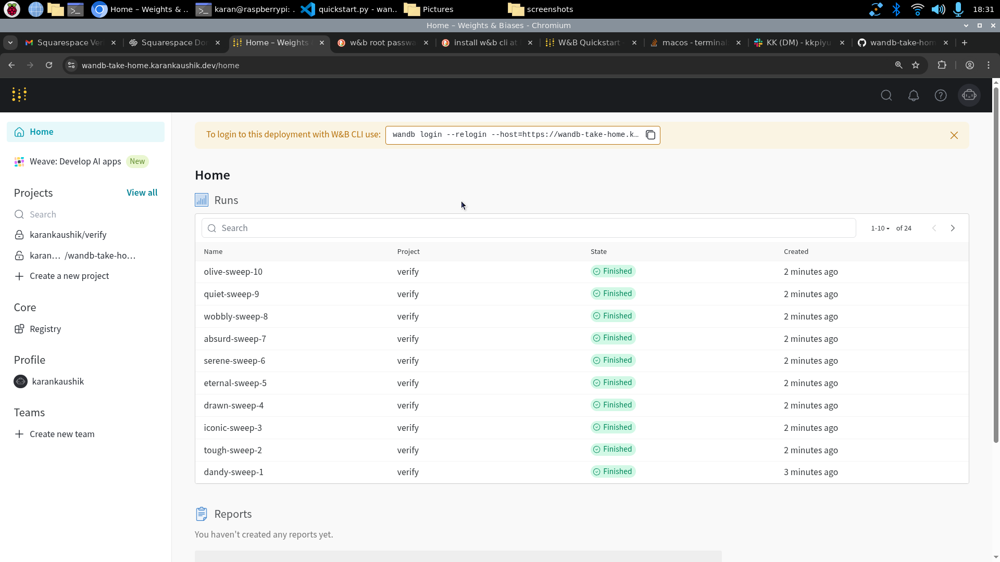
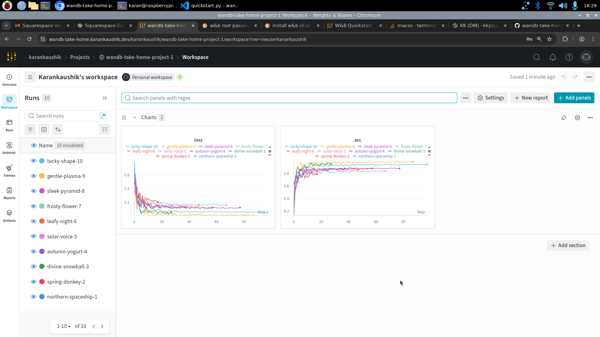
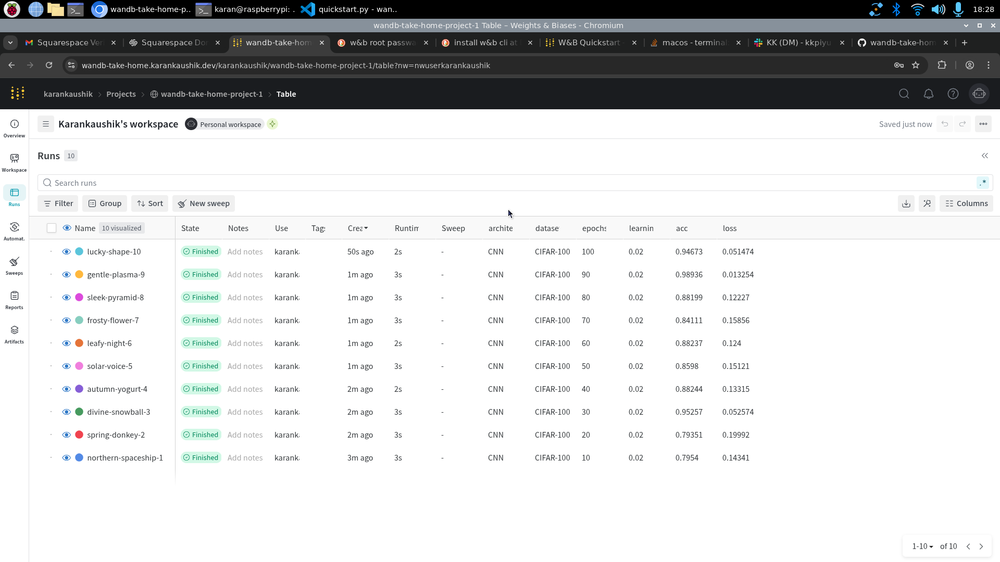
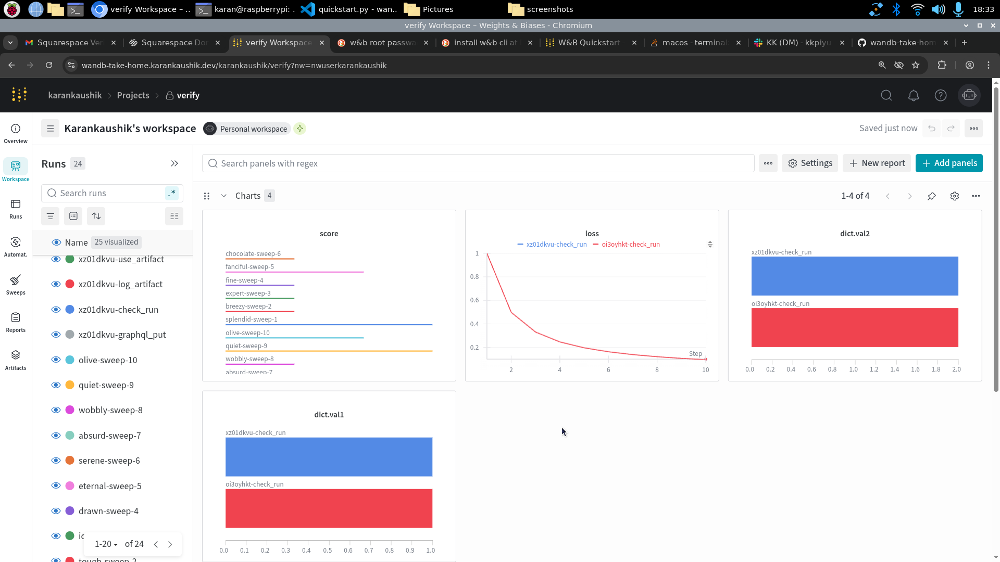
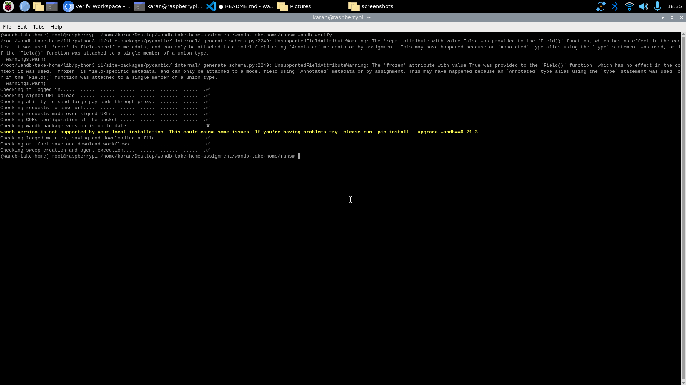

# README for the take home assignment

## Prerequisites
- VS Code for creating README
- Install Terraform
- Install and configure gcloud
- Install kubectl 
- Install helm

## Assumptions
- CSP of choice -> Google Cloud

## Steps
- Cloning the Terraform Repo - https://github.com/wandb/terraform-google-wandb
- Create GCP Project - wandb-take-home-1
- Use `gcloud init` to initialise gcloud cli and set project and compute region
- Using TF files for Standard TF deloyment found in TF repo
- Create license key for deployment
- Creating terraform.tfvars to provide all the variables necessary
- Run `gcloud auth application-default login` to setup default credentials before running tf
- TF creation worked but cluster did not have nodes available, after checking it was a quota issue
- Checked another region of availability of quota, destroyed and created the setup in another region, moving to operator based deployment
- Use Helm charts/operator to install/deploy operator and wandb setup
- Use quickstart docs to run python quickstart program
- change epoch values from 10 to 100 for 10 different runs

## screenshots
- TF INIT 
- W&B Home 
- Workspace 
- Runs 
- Verify Console 
- Verify CLI 
- GCP Resources 